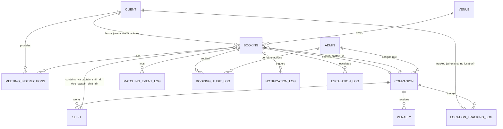

# Data Entities

> Derived from flows: **1.1 Onboarding & Profile**, **1.2 Booking & Allocation**, **2.1 Pre-Arrival & Deployment**

---

## 1. Client

**Purpose:** Represents end-users who book companion services.

| Field | Type | Constraints | Description |
|-------|------|-------------|-------------|
| `client_id` | UUID | PK | Unique identifier |
| `full_name` | String | Required | Full name (admin use only, never shown to companions) |
| `nickname` | String | Required | Displayed to companions during session (1.2.1.8.2) |
| `phone_number` | String | Unique, Required | Used for OTP auth, notifications, and escalation calls |
| `email` | String | Nullable | Optional email |
| `profile_language` | Enum | Required | `EN`, `AR` — controls UI language only |
| `payment_method_token` | String | Nullable | PCI-compliant tokenized payment method |
| `push_notification_token` | String | Nullable | Device push notification token for real-time updates |
| `device_id` | String | Nullable | Device identifier (logged per booking for audit) |
| `current_booking_id` | UUID | FK → Booking, Nullable | Points to active/pending booking |
| `booking_status_cache` | Enum | Default: `NONE` | `NONE`, `PENDING`, `CONFIRMED`, `ACTIVE` — cached for FE redirect logic (1.2.1.1.2) |
| `gps_permission_granted` | Boolean | Default: false | Whether client has granted GPS permission |
| `last_known_latitude` | Decimal | Nullable | Last GPS latitude |
| `last_known_longitude` | Decimal | Nullable | Last GPS longitude |
| `last_gps_update_at` | Timestamp | Nullable | Timestamp of last GPS ping |
| `consent_version` | String | Nullable | Latest T&C version accepted |
| `consent_accepted_at` | Timestamp | Nullable | When T&C was last accepted |
| `average_rating` | Decimal | Nullable | Future: Client rating |
| `total_bookings` | Integer | Default: 0 | Historical booking count |
| `created_at` | Timestamp | Required | Account creation |
| `updated_at` | Timestamp | Required | Last profile update |

**Business Rules:**
- One active booking per client at a time (enforced via `current_booking_id` unique constraint) (1.2.1.1.3)
- Phone number is unique across all clients
- OTP-based authentication (no password)
- Nickname is visible to companions; full name is not
- If `booking_status_cache` is `PENDING`, `CONFIRMED`, or `ACTIVE`, client is redirected to Booking Details (1.2.1.1.2)

---

## 2. Companion

**Purpose:** Represents service providers (Captains and Vice Captains).

| Field | Type | Constraints | Description |
|-------|------|-------------|-------------|
| `companion_id` | UUID | PK | Unique identifier |
| `full_name` | String | Required | Full name |
| `phone_number` | String | Unique, Required | Contact number for notifications |
| `email` | String | Nullable | Email address |
| `role` | Enum | Required | `CAPTAIN`, `VICE_CAPTAIN` — assigned by Admin (1.1) |
| `is_active` | Boolean | Default: true | Employment/activation status |
| `physical_stats` | JSON | Nullable | Height, build, etc. (onboarding) |
| `language_skills` | JSON | Required | Array: `["EN", "AR"]` etc. |
| `background_verified` | Boolean | Default: false | Background check status — must be true before activation |
| `push_notification_token` | String | Nullable | Device push notification token |
| `device_id` | String | Nullable | Primary device identifier |
| `current_shift_id` | UUID | FK → Shift, Nullable | Active shift reference |
| `gps_enabled` | Boolean | Default: false | GPS permission status — must be always on during shifts (1.2.2.5) |
| `last_known_latitude` | Decimal | Nullable | Current GPS latitude |
| `last_known_longitude` | Decimal | Nullable | Current GPS longitude |
| `last_gps_update_at` | Timestamp | Nullable | Last GPS ping timestamp |
| `penalty_status` | Enum | Default: `CLEAR` | `CLEAR`, `WARNING`, `PENALIZED` |
| `average_rating` | Decimal | Nullable | Future: Performance rating |
| `total_sessions` | Integer | Default: 0 | Completed sessions count |
| `created_at` | Timestamp | Required | Onboarding date |
| `updated_at` | Timestamp | Required | Last profile update |

**Business Rules:**
- Role assigned by Admin only (cannot self-select) (1.1)
- GPS must remain enabled at all times during shifts (1.2.2.5)
- Background verification required before activation
- Both Captain and Vice Captain required to form a Duo (1.2.3.2)
- Cannot decline individual bookings; can only cancel entire shift (1.2.2.3)

---

## 3. Venue

**Purpose:** Represents partnered locations (malls, clubs, restaurants) where bookings take place.

| Field | Type | Constraints | Description |
|-------|------|-------------|-------------|
| `venue_id` | UUID | PK | Unique identifier |
| `name` | String | Required | Venue display name |
| `type` | Enum | Required | `MALL`, `CLUB`, `RESTAURANT` |
| `address` | String | Required | Full address |
| `latitude` | Decimal | Required | GPS latitude (for geolocation sorting and geo-fence) |
| `longitude` | Decimal | Required | GPS longitude |
| `country` | String | Required | Country code |
| `operating_hours_start` | Time | Required | General opening time (informational; client's responsibility to verify) |
| `operating_hours_end` | Time | Required | General closing time |
| `is_active` | Boolean | Default: true | Whether venue is currently partnered |
| `created_at` | Timestamp | Required | Partnership start |
| `updated_at` | Timestamp | Required | Last update |

**Business Rules:**
- All partnered venues are listed globally regardless of distance/country (1.2.1.2.3)
- FE sorts results with nearest venue at top via geolocation (1.2.1.2.3)
- All selectable venues are pre-defined and geo-fenced by default (1.2.1.2.5)
- Venue operating hours are general/informational. If the venue is unexpectedly closed, it is the client's responsibility (1.2.1.2.7)
- Bookings are specific to a venue and cannot be transferred (1.2.1.2.6)
- Capacity is not venue-mapped; active booking count per venue can be queried from booking data

---

## 4. Shift

**Purpose:** Represents a companion's general work shift (not location-specific).

| Field | Type | Constraints | Description |
|-------|------|-------------|-------------|
| `shift_id` | UUID | PK | Unique identifier |
| `companion_id` | UUID | FK → Companion, Required | Assigned companion |
| `date` | Date | Required | Shift date |
| `start_time` | Time | Required | Shift start |
| `end_time` | Time | Required | Shift end |
| `status` | Enum | Required | `SCHEDULED`, `ACTIVE`, `COMPLETED`, `CANCELLED` |
| `cancellation_reason` | String | Nullable | Reason if cancelled |
| `cancelled_at` | Timestamp | Nullable | Cancellation timestamp |
| `penalty_applied` | Boolean | Default: false | Whether cancellation triggered a penalty (1.2.2.3) |
| `created_at` | Timestamp | Required | Shift creation |
| `updated_at` | Timestamp | Required | Last update |

**Business Rules:**
- Shifts are **general availability** — not tied to a specific venue. Companions can be assigned to any venue during their shift.
- Companions can only cancel their entire shift, not individual bookings (1.2.2.3)
- Cancelling within configurable window (e.g., < 4 hours) triggers penalty (1.2.2.3)
- Shift cancellation triggers Auto-Reallocator for all bookings in that shift (1.2.2.3)
- System blocks companion calendar for 2h (session) + 20m (rest buffer) per booking (1.2.2.1)
- 30-minute buffer enforced between a Duo's bookings (1.2.5.4)

---

## 5. Booking

**Purpose:** Represents a single client booking for companion service.

| Field | Type | Constraints | Description |
|-------|------|-------------|-------------|
| `booking_id` | UUID | PK | Unique identifier |
| `client_id` | UUID | FK → Client, Required | Booking client |
| `venue_id` | UUID | FK → Venue, Required | Partnered venue (mall/club/restaurant) |
| `captain_id` | UUID | FK → Companion, Nullable | Assigned Captain (null until allocation) |
| `vice_captain_id` | UUID | FK → Companion, Nullable | Assigned Vice Captain (null until allocation) |
| `allocation_mode` | Enum | Default: `AUTO` | `AUTO`, `CAPTAIN_SPECIFIED`, `VICE_CAPTAIN_SPECIFIED`, `BOTH_SPECIFIED` — how companions were assigned (1.2.3.1). Client FE always uses AUTO; selective modes are Admin-only. |
| `captain_shift_id` | UUID | FK → Shift, Nullable | Captain's shift this booking belongs to (for Auto-Reallocator lookup) |
| `vice_captain_shift_id` | UUID | FK → Shift, Nullable | Vice Captain's shift this booking belongs to |
| `client_nickname_snapshot` | String | Required | Snapshot of client nickname at booking time (immutable for session) |
| `duo_status` | Enum | Default: `PENDING` | `PENDING`, `MATCHED`, `ACTIVATED`, `BREACH` — tracks readiness of the two companions. If BREACH at T-20m, booking auto-cancels. |
| `duo_matched_at` | Timestamp | Nullable | When Captain scanned Vice Captain's QR (2.1.4) |
| `duo_activated_at` | Timestamp | Nullable | When both companions signaled readiness |
| `duo_breach_reported_at` | Timestamp | Nullable | If readiness not signaled by T-30m (1.2.2.6) |
| `duo_qr_code` | String | Nullable | QR code for companion-to-companion matching (separate from client QR) |
| `duo_pin_code` | String(6) | Nullable | Static fallback PIN for companion matching if QR fails (2.1.4) |
| `captain_location_confirmed_at` | Timestamp | Nullable | When Captain confirmed location at T-30m (2.1.2.3) |
| `vice_captain_location_confirmed_at` | Timestamp | Nullable | When Vice Captain confirmed location at T-30m (2.1.2.3) |
| `date` | Date | Required | Booking date |
| `start_time` | Time | Required | Scheduled start time |
| `end_time` | Time | Required | Scheduled end time (start + 2 hours) |
| `duration_minutes` | Integer | Default: 120 | Fixed 2-hour duration (1.2.1.3.3) |
| `status` | Enum | Required | `PENDING`, `CONFIRMED`, `ACTIVE`, `COMPLETED`, `CANCELLED`, `FAILED` |
| `base_rate` | Decimal | Required | Base price |
| `vat_amount` | Decimal | Required | VAT |
| `service_fee` | Decimal | Required | Service fee |
| `grand_total` | Decimal | Required | Total (base + VAT + service fee) (1.2.1.4.1) |
| `payment_hold_status` | Enum | Default: `NONE` | `NONE`, `HELD`, `CHARGED`, `VOIDED`, `REFUNDED` |
| `payment_hold_amount` | Decimal | Nullable | Amount held |
| `soft_lock_expires_at` | Timestamp | Nullable | 15-minute soft-lock expiry on Duo (1.2.1.5.2) |
| `qr_code` | String | Nullable | Generated QR code for session start (1.3.4.1) |
| `pin_code` | String(4) | Nullable | 4-digit backup PIN (1.3.4.1) |
| `consent_accepted` | Boolean | Default: false | Whether client accepted mandatory consent (1.2.1.4.4) |
| `consent_version_accepted` | String | Nullable | Version of T&C accepted for this specific booking |
| `booking_notes` | String | Nullable | Admin-editable notes visible to companions (read-only for companions) (2.1.5) |
| `failure_reason` | String | Nullable | Reason if booking failed (e.g., soft-lock expired, allocation timeout, race condition) |
| `cancellation_reason` | String | Nullable | Reason if cancelled |
| `cancelled_by` | Enum | Nullable | `CLIENT`, `ADMIN`, `SYSTEM` |
| `cancelled_at` | Timestamp | Nullable | Cancellation timestamp |
| `refund_amount` | Decimal | Nullable | Calculated refund (1.2.5.1) |
| `refund_percentage` | Integer | Nullable | 100%, 50%, or 0% based on timeframe |
| `session_started_at` | Timestamp | Nullable | When QR handshake completed |
| `session_ended_at` | Timestamp | Nullable | When session ended |
| `client_no_show` | Boolean | Default: false | If client did not show up (1.2.4.3) |
| `created_at` | Timestamp | Required | Booking creation |
| `updated_at` | Timestamp | Required | Last update |

**Business Rules:**
- Fixed 2-hour duration; cannot be customized (1.2.1.3.3)
- Min lead time: 24 hours; max advance: 14 days (1.2.1.3.1)
- **Soft-Lock (PENDING):** When client hits "Book Now", a 15-minute soft-lock is placed on the specific Captain + Vice Captain. No other client can book them during this window. If payment completes (200 response), soft-lock converts to confirmed booking. If soft-lock expires without payment, companions are released, booking → `FAILED`.
- **Phase 1 — Client-to-Companions Match (at booking time):** Allocation engine assigns `captain_id` and `vice_captain_id`. Once payment succeeds, booking status → `CONFIRMED`.
- **Phase 2 — Companion-to-Companion Match (at T-30m):** Captain and Vice Captain physically meet, scan QR. `duo_status` → `MATCHED` → `ACTIVATED`. These are independent lifecycles.
- A booking is only valid if both `captain_id` and `vice_captain_id` are assigned (1.2.3.2)
- If QR fails after 2 attempts, fallback to manual PIN (2.1.4)
- If both QR and PIN fail, admin is notified for manual match (2.1.4)
- **Duo Breach (T-20m):** If companions have not matched by 20 minutes before booking start, the booking is **automatically cancelled**. Client is refunded. Companions receive violation records. Hot Swap is not supported in this version.
- **Client No-Show (T+15m):** If client does not arrive and complete QR handshake within 15 minutes after scheduled start, booking is **automatically marked as completed**. No refund. Companions are released for their next assignment. Client is freed to rebook.
- If client arrives late but before T+15m, the session still ends at original scheduled end time (start + 2h). No extension.
- Promo codes not supported in Phase 1 (1.2.1.4.1)

---

## 6. Meeting Instructions

**Purpose:** Stores client-provided meeting instructions for companions during the pre-deployment matching phase.

| Field | Type | Constraints | Description |
|-------|------|-------------|-------------|
| `instruction_id` | UUID | PK | Unique identifier |
| `booking_id` | UUID | FK → Booking, Required | Associated booking |
| `client_id` | UUID | FK → Client, Required | Instruction author |
| `text_note` | String | Nullable | Manual text instructions from client (2.2.1.1) |
| `image_url` | String | Nullable | Uploaded image of nearby store/landmark (2.2.1.1) |
| `instruction_type` | Enum | Required | `LOCATION_SHARE`, `IMAGE_UPLOAD`, `TEXT_INPUT` |
| `status` | Enum | Default: `SENT` | `SENT`, `RECEIVED`, `ACKNOWLEDGED` |
| `created_at` | Timestamp | Required | Instruction creation |
| `updated_at` | Timestamp | Required | Last update |

**Business Rules:**
- Stored per active booking only (not in client profile)
- Client can update instructions multiple times; latest version is shown to companions
- Companions cannot edit instructions (2.1.5)
- If client declines GPS, they must provide text or image instructions (2.2.1.2.1)

---

## 7. Matching Event Log

**Purpose:** Logs every matching event between companions (Duo matching) and between Duo and client (session start).

| Field | Type | Constraints | Description |
|-------|------|-------------|-------------|
| `event_id` | UUID | PK | Unique identifier |
| `booking_id` | UUID | FK → Booking, Required | Associated booking |
| `event_type` | Enum | Required | `DUO_QR_SCAN`, `DUO_PIN_ENTRY`, `DUO_ADMIN_MATCH`, `CLIENT_QR_SCAN`, `CLIENT_PIN_ENTRY` |
| `initiated_by_companion_id` | UUID | FK → Companion, Nullable | Who scanned/entered |
| `target_companion_id` | UUID | FK → Companion, Nullable | Who was scanned (for Duo match) |
| `client_id` | UUID | FK → Client, Nullable | Client involved (for session start) |
| `method` | Enum | Required | `QR`, `PIN`, `ADMIN_MANUAL` |
| `attempt_number` | Integer | Required | Attempt count (max 2 for QR before PIN fallback) (2.1.4) |
| `result` | Enum | Required | `SUCCESS`, `FAILURE` |
| `gps_latitude` | Decimal | Nullable | Location at time of event |
| `gps_longitude` | Decimal | Nullable | Location at time of event |
| `device_id` | String | Nullable | Device used for scanning (2.1.4) |
| `created_at` | Timestamp | Required | Event timestamp |

**Business Rules:**
- QR scan allows up to 2 attempts before PIN fallback is shown (2.1.4)
- If both QR and PIN fail, admin is notified (2.1.4)
- All matching events are logged for audit (2.1.4)

---

## 8. Booking Audit Log

**Purpose:** Immutable audit trail for all booking actions.

| Field | Type | Constraints | Description |
|-------|------|-------------|-------------|
| `audit_id` | UUID | PK | Unique identifier |
| `booking_id` | UUID | FK → Booking, Required | Associated booking |
| `action` | Enum | Required | `CREATED`, `CONFIRMED`, `CANCELLED`, `REALLOCATED`, `STARTED`, `COMPLETED`, `FAILED`, `REFUNDED`, `AUTO_CANCELLED_BREACH`, `AUTO_COMPLETED_NO_SHOW`, `ADMIN_OVERRIDE` |
| `performed_by_type` | Enum | Required | `CLIENT`, `COMPANION`, `ADMIN`, `SYSTEM` |
| `performed_by_id` | UUID | Required | Actor ID |
| `device_id` | String | Nullable | Device ID at time of action (1.2.4.2) |
| `pricing_engine_version` | String | Nullable | Pricing engine version at booking time (1.2.4.2) |
| `allocation_engine_version` | String | Nullable | Allocation engine version at booking time |
| `client_latitude` | Decimal | Nullable | Client location at time of action (1.2.4.2) |
| `client_longitude` | Decimal | Nullable | Client location at time of action |
| `metadata` | JSON | Nullable | Additional context (e.g., cancellation reason, refund details) |
| `created_at` | Timestamp | Required | Action timestamp |

**Business Rules:**
- All bookings log Device ID, Pricing Engine version, Allocation Engine version, and Client location (1.2.4.2)
- Immutable: records cannot be updated or deleted
- Admin actions are always logged (1.2.4.1)

---

## 9. Location Tracking Log

**Purpose:** Stores periodic GPS pings for companions during pre-arrival tracking window.

| Field | Type | Constraints | Description |
|-------|------|-------------|-------------|
| `tracking_id` | UUID | PK | Unique identifier |
| `tracked_entity_type` | Enum | Required | `COMPANION`, `CLIENT` — who is being tracked |
| `tracked_entity_id` | UUID | Required | companion_id or client_id |
| `booking_id` | UUID | FK → Booking, Nullable | Associated booking |
| `latitude` | Decimal | Required | GPS latitude |
| `longitude` | Decimal | Required | GPS longitude |
| `tracking_phase` | Enum | Required | `PRE_ARRIVAL`, `POST_MATCH`, `CLIENT_EN_ROUTE`, `IN_SERVICE` |
| `created_at` | Timestamp | Required | Ping timestamp |

**Business Rules:**
- Companion tracking begins 45 minutes before roster time (2.1.3.3)
- Companion tracking continues after matching (`POST_MATCH`) so client can see real-time location (2.1.5)
- Client tracking (`CLIENT_EN_ROUTE`) begins when client shares location and enters venue premises (2.2.1.2.1)
- System continuously monitors GPS during active tracking phases (2.1.3.3)

---

## 10. Notification Log

**Purpose:** Tracks all push notifications, reminders, and escalation calls sent to clients and companions.

| Field | Type | Constraints | Description |
|-------|------|-------------|-------------|
| `notification_id` | UUID | PK | Unique identifier |
| `recipient_type` | Enum | Required | `CLIENT`, `COMPANION`, `ADMIN` |
| `recipient_id` | UUID | Required | Recipient's ID |
| `booking_id` | UUID | FK → Booking, Nullable | Associated booking |
| `notification_type` | Enum | Required | `BATTERY_CHECK`, `MATCH_PENDING`, `LOCATION_CONFIRM`, `BOOKING_CONFIRMED`, `COMPANIONS_READY`, `ESCALATION_CALL`, `CANCELLATION`, `REMINDER`, `BREACH_ALERT` |
| `channel` | Enum | Required | `PUSH`, `SMS`, `AUTOMATED_CALL` |
| `content` | String | Nullable | Notification content/template |
| `status` | Enum | Required | `SENT`, `DELIVERED`, `READ`, `FAILED` |
| `created_at` | Timestamp | Required | Sent timestamp |

**Business Rules:**
- Battery check notification sent a few hours before booking (1.2.2.2)
- 4h, 2h, and 30m pre-roster notifications for companions (2.1.2)
- Client notified 30 minutes before booking that companions are ready (2.1.5)
- Escalation: follow-up at 10 minutes, automated call at 20 minutes if client unresponsive (2.2.2.2)

---

## 11. Penalty / Violation Record

**Purpose:** Tracks penalties and violations issued to companions.

| Field | Type | Constraints | Description |
|-------|------|-------------|-------------|
| `penalty_id` | UUID | PK | Unique identifier |
| `companion_id` | UUID | FK → Companion, Required | Penalized companion |
| `shift_id` | UUID | FK → Shift, Nullable | Related shift |
| `booking_id` | UUID | FK → Booking, Nullable | Related booking |
| `type` | Enum | Required | `SHIFT_CANCELLATION`, `BREACH`, `NO_SHOW`, `LATE_ARRIVAL`, `OTHER` |
| `reason` | String | Required | Description of the violation |
| `severity` | Enum | Required | `LOW`, `MEDIUM`, `HIGH` |
| `issued_by` | Enum | Required | `SYSTEM`, `ADMIN` |
| `issued_at` | Timestamp | Required | When penalty was issued |
| `resolved` | Boolean | Default: false | Whether the penalty has been resolved |
| `resolved_at` | Timestamp | Nullable | Resolution timestamp |

**Business Rules:**
- Shift cancellation within configurable window triggers penalty (1.2.2.3)
- Duo not ready by T-30m = BREACH (1.2.2.6)
- Missing companion triggers re-allocation + violation record (1.2.1.8.1)
- Full violation history is retained (never purged)

---

## 12. Escalation Log

**Purpose:** Tracks escalation events during client-companion meeting phase.

| Field | Type | Constraints | Description |
|-------|------|-------------|-------------|
| `escalation_id` | UUID | PK | Unique identifier |
| `booking_id` | UUID | FK → Booking, Required | Associated booking |
| `level` | Enum | Required | `LEVEL_1_NOTIFICATION`, `LEVEL_2_FOLLOWUP`, `LEVEL_3_AUTOMATED_CALL`, `LEVEL_4_ADMIN` |
| `triggered_at` | Timestamp | Required | When escalation was triggered |
| `action_taken` | String | Nullable | Description of resolution |
| `resolved` | Boolean | Default: false | Whether resolved |
| `resolved_at` | Timestamp | Nullable | Resolution timestamp |

**Business Rules:**
- If client does not respond within 10 minutes: Level 2 follow-up (2.2.2.2)
- After 20 minutes: Level 3 automated call (2.2.2.2)
- If no resolution after 45 minutes: booking progresses, client's responsibility (2.2.3.4)
- Contacting admin is last resort (2.2.3.3)

---

## 13. Admin

**Purpose:** System administrators with manual override capabilities.

| Field | Type | Constraints | Description |
|-------|------|-------------|-------------|
| `admin_id` | UUID | PK | Unique identifier |
| `name` | String | Required | Full name |
| `email` | String | Unique, Required | Login email |
| `role` | Enum | Required | `SUPER_ADMIN`, `SUPPORT`, `OPERATIONS` |
| `permissions` | JSON | Required | Permission flags |
| `is_active` | Boolean | Default: true | Account status |
| `created_at` | Timestamp | Required | Account creation |
| `updated_at` | Timestamp | Required | Last update |

**Business Rules:**
- Admin can manually assign, re-assign, update, or cancel any booking (1.2.4.1)
- Admin-initiated cancellation = 100% refund (1.2.5.1)
- Admin cannot "update" a client booking, only cancel (1.2.1.8.3)
- Admin can trigger Hot Swap for breached Duos (1.2.2.6)
- Admin can manually match companions if QR/PIN both fail (2.1.4)

---

## 14. Data Relationships

---

## 15. Open Questions & Resolutions

* **Physical ID Verification:** Should we require Emirates ID/Passport during client onboarding?
  * **Recommendation:** Phase 1 — Optional. Phase 2 — Required for high-value bookings.
  
* **Payment Method Storage:** Confirm PCI compliance approach.
  * **Resolution:** Use tokenized payment methods only. No raw card data stored.
  
* **Companion Role Changes:** Can companions switch between Captain/Vice Captain roles?
  * **Recommendation:** Track role history if role changes are permitted. Current schema supports single active role.

* **Race Condition (1.2.5.3):** Resolving simultaneous "Pay" hits for the same Duo — TBD.

* **Payment Failures (1.2.5.2):** Logic for handling DB lock failures after successful payment — TBD.

### Questions Raised During Flow Simulation

* **Q1 — Venue Operating Hours:** Do venues have different hours on weekends or holidays?
  * **Resolution:** Not required. The Roster algorithm already accounts for venue timings when generating shifts and availability. No separate schedule entity needed.

* **Q2 — Refund Logic Contradiction:** Flow 1.2.5.1 and 1.2.1.8.1 have conflicting refund percentages.
  * **Resolution:** Deferred. Refund logic to be finalized in a future iteration.

* **Q3 — Booking CONFIRMED vs Duo Matching Timing:** When does companion allocation vs duo activation happen?
  * **Resolution:** Two separate processes:
    1. **At booking time:** The allocation engine assigns a Captain + Vice Captain to the booking. Once payment succeeds (200 response), soft-lock converts to confirmed booking. Status: `PENDING` → `CONFIRMED`.
    2. **At T-30m (day of service):** The two assigned companions physically meet at the venue, scan QR to verify each other. `duo_status`: `PENDING` → `MATCHED` → `ACTIVATED`.
  * These are independent lifecycles. A booking can be `CONFIRMED` for days while `duo_status` remains `PENDING` until T-30m.

* **Q4 — Soft-Lock Definition:** What does the soft-lock actually lock?
  * **Resolution:** The soft-lock is applied to specific companions (Captain + Vice Captain) for the selected time slot when the client presses "Book Now" but hasn't completed payment. No other client can book those companions during this window. Once payment completes, the soft-lock converts to a confirmed booking. If the 15-minute window expires, companions are released.

* **Q5 — Roster Time vs Booking Time:** Are pre-deployment notifications per-shift or per-booking?
  * **Resolution:** Roster Time = shift start. Booking Time = specific booking start. Pre-deployment notifications (T-4h, T-2h, T-30m) reference Roster Time (shift start), not individual bookings. A companion reports once per shift.

* **Q6 — Hot Swap Logic:**
  * **Resolution:** Hot Swap is **not supported** in this version. If companions fail to match by T-20m (20 minutes before booking start), the booking is **automatically cancelled**. Client is notified, refunded, and freed to rebook. Companions receive violation records.

* **Q7 — Client No-Show / T+15m Rule:**
  * **Resolution:** If the client does not arrive and complete the QR handshake within 15 minutes after scheduled booking time (T+15m), the booking is **automatically marked as completed**. No refund. Companions are released. Client is freed to make a new booking. If client arrives late but before T+15m, session still ends at original scheduled end time (start + 2h).

---

## 16. Technical Notes

**Authentication:**
- Client: OTP via SMS to phone number
- Companion: Admin-provisioned credentials
- Admin: Email + password with 2FA

**Data Privacy:**
- GPS data stored with user consent only
- Payment tokens stored in PCI-compliant vault
- Personal data encrypted at rest
- Location tracking logs retained per policy

**Localization:**
- UI supports English and Arabic
- Language preference stored in client profile (controls UI only)
- All notification content respects user language setting
