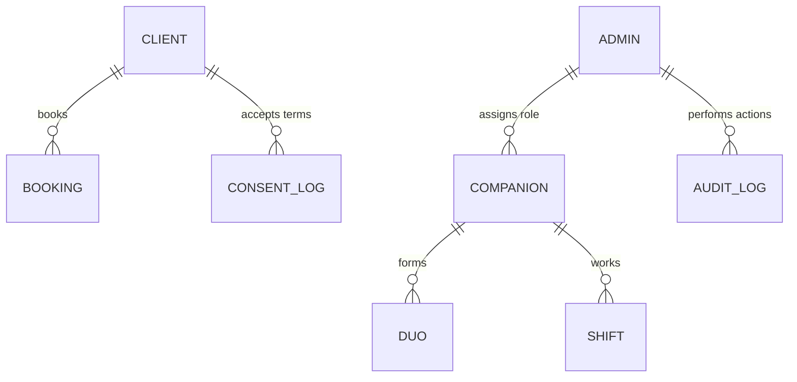

## 1.1.3 Client Persona Schema

**Purpose:** Represents end-users who book companion services.

| Field | Type | Constraints | Description |
|-------|------|-------------|-------------|
| `client_id` | UUID | PK | Unique identifier |
| `phone_number` | String | Unique, Required | Used for OTP authentication |
| `name` | String | Required | Full name |
| `email` | String | Nullable | Optional email |
| `profile_language` | Enum | Required | `EN`, `AR` |
| `current_booking_id` | UUID | FK → Booking, Nullable | Points to active/pending booking |
| `booking_status_cache` | Enum | Default: NONE | `NONE`, `PENDING`, `CONFIRMED`, `ACTIVE` |
| `payment_method_token` | String | Nullable | PCI-compliant tokenized payment |
| `last_known_latitude` | Decimal | Nullable | GPS location |
| `last_known_longitude` | Decimal | Nullable | GPS location |
| `gps_permission_granted` | Boolean | Default: false | GPS permission status |
| `consent_version` | String | Nullable | Latest T&C version accepted |
| `consent_accepted_at` | Timestamp | Nullable | When T&C was accepted |
| `average_rating` | Decimal | Nullable | Future: Client rating |
| `total_bookings` | Integer | Default: 0 | Historical booking count |
| `created_at` | Timestamp | Required | Account creation |
| `updated_at` | Timestamp | Required | Last profile update |

**Business Rules:**
- One active booking per client (enforced via unique constraint)
- Phone number is unique across all clients
- OTP-based authentication (no password)

---

## 1.1.4 Companion Persona Schema

**Purpose:** Represents service providers (Captains and Companions).

| Field | Type | Constraints | Description |
|-------|------|-------------|-------------|
| `companion_id` | UUID | PK | Unique identifier |
| `name` | String | Required | Full name |
| `phone_number` | String | Unique, Required | Contact number |
| `email` | String | Nullable | Email address |
| `role` | Enum | Required | `CAPTAIN`, `COMPANION` |
| `is_active` | Boolean | Default: true | Employment status |
| `physical_stats` | JSON | Nullable | Height, build, etc. |
| `language_skills` | JSON | Required | Array: `["EN", "AR", "FR"]` |
| `background_verified` | Boolean | Default: false | Background check status |
| `current_shift_id` | UUID | FK → Shift, Nullable | Active shift reference |
| `gps_enabled` | Boolean | Default: false | GPS permission status |
| `last_known_latitude` | Decimal | Nullable | Current location |
| `last_known_longitude` | Decimal | Nullable | Current location |
| `last_gps_update_at` | Timestamp | Nullable | Last GPS ping |
| `battery_notification_sent_at` | Timestamp | Nullable | Last battery check alert |
| `average_rating` | Decimal | Nullable | Future: Performance rating |
| `total_sessions` | Integer | Default: 0 | Completed sessions count |
| `created_at` | Timestamp | Required | Onboarding date |
| `updated_at` | Timestamp | Required | Last profile update |

**Business Rules:**
- Role assigned by Admin (cannot self-select)
- GPS must remain enabled during shifts
- Background verification required before activation
- Both Captain and Companion roles required to form a Duo

---

## 1.1.5 Supporting Schemas

### Admin Schema
**Purpose:** System administrators with manual override capabilities.

| Field | Type | Description |
|-------|------|-------------|
| `admin_id` | UUID | Unique identifier |
| `name` | String | Full name |
| `email` | String | Login email (unique) |
| `role` | Enum | `SUPER_ADMIN`, `SUPPORT`, `OPERATIONS` |
| `permissions` | JSON | Permission flags |
| `is_active` | Boolean | Account status |
| `created_at` | Timestamp | Account creation |

---

## 1.1.6 Data Relationships

---

## 1.1.7 Open Questions & Resolutions

* **Physical ID Verification:** Should we require Emirates ID/Passport during client onboarding?
  * **Recommendation:** Phase 1 - Optional. Phase 2 - Required for high-value bookings.
  
* **Payment Method Storage:** Confirm PCI compliance approach.
  * **Resolution:** Use tokenized payment methods only. No raw card data stored.
  
* **Companion Role Changes:** Can companions switch between Captain/Companion roles?
  * **Recommendation:** Track role history if role changes are permitted. Current schema supports single active role.

---

## 1.1.8 Technical Notes

**Authentication:**
- Client: OTP via SMS to phone number
- Companion: Admin-provisioned credentials
- Admin: Email + password with 2FA

**Data Privacy:**
- GPS data stored with user consent only
- Payment tokens stored in PCI-compliant vault
- Personal data encrypted at rest

**Localization:**
- UI supports English and Arabic
- Language preference stored in profile
- All communications respect user language setting
